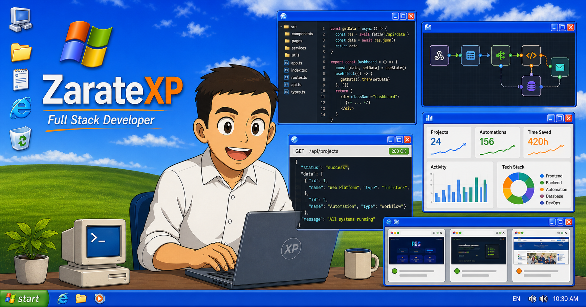

# ZarateXP Portfolio

[](#)
[](#)
[](#)
[](#)
[](#)

Portfolio interactivo de Ivan Agustin Zarate, **Software Analyst & Project Manager** enfocado en **Software, Data & AI Solutions** con Java, Spring Boot, React y Oracle. La experiencia inspirada en Windows XP funciona como un escritorio navegable con un perfil orientado a oportunidades de Forward Deployed Engineer (FDE), CV actualizado, casos institucionales, proyectos, automatizaciones, APIs y aplicaciones funcionales.

## Demo

- Portfolio: [GitHub Pages](https://iazara.github.io/ZarateXP-Portfolio_v1/)
- GitHub: [@IAZARA](https://github.com/IAZARA)
- LinkedIn: [ivan-agustin-zarate](https://www.linkedin.com/in/ivan-agustin-zarate/)
- ForzaTech: [forzatech.com.ar](https://forzatech.com.ar/)

## Etiquetas

`forward-deployed-engineering` `mlops` `platforms` `data-privacy` `portfolio` `windows-xp` `java` `spring-boot` `react` `typescript` `oracle` `gis` `osint` `automation`

## Que incluye

- Escritorio estilo Windows XP con pantalla de arranque y login.
- Sistema de ventanas con arrastre, foco, minimizar, maximizar, cierre animado y botones activos en taskbar.
- Menu de inicio con accesos a CV, documentos, proyectos, contacto, redes, juegos y accesorios.
- Perfil orientado a FDE con experiencia, modelo de trabajo, casos, capacidades, formación, idiomas y contacto.
- Wallpaper HD original e iconos SVG nítidos para escritorio, taskbar y ventanas.
- Visor de CV actualizado en PDF.
- Carpeta Mis Documentos con CV, perfil profesional, notas y accesos a proyectos.
- Explorador de proyectos con vista de iconos/lista y detalle embebido.
- Casos destacados: CUFRE, SIFEBU, CRIACO y OSINTArgy, además de ZarateXP, ForzaTech, WJPC Capitulo Argentino y sistemas full stack.
- API Center con Open-Meteo, wttr.in, GitHub REST, Countries y Banco Mundial, cache con TTL, cancelación, estados de frescura y recuperación offline.
- Apps retro: Winamp Pro, Paint mejorado, Buscaminas robusto, Solitario, Pinball, Bloc de notas y WordPad.
- PDF Studio para abrir PDFs locales, revisar el CV, anotar observaciones y usar File/Blob APIs.
- Panel de control para personalizar fondo, tema, iconos, efecto CRT y taskbar.
- Flujos n8n visuales con simulacion funcional de ejecucion.
- Perfil profesional actualizado con experiencia institucional, MLOps, gestión de datos sensibles, coordinación y formación.

## Stack

- HTML5
- CSS3 modular
- JavaScript ES modules
- Fetch API, Web Audio API, Canvas 2D, File API y localStorage
- XP.css para componentes visuales base
- EmailJS para formulario de contacto
- Assets estaticos listos para GitHub Pages

## Apps destacadas

- **API Center:** consumo REST real de clima, repositorios y datos publicos con cache, proveedor secundario y manejo de errores.
- **Winamp XP Pro:** reproductor de MP3 locales y loops Web Audio con playlist, visualizador Canvas, controles completos, balance y ecualizador de tres bandas.
- **PDF Studio:** visor de CV/PDF local con zoom, rotacion, descarga, impresion y notas persistentes.
- **Perfil orientado a FDE:** recorrido ejecutivo para evaluar experiencia profesional, forma de trabajo, casos, stack, formación e idiomas.
- **Buscaminas XP:** primer clic seguro, banderas, dudas, timer, dificultades y deteccion de victoria/derrota.
- **Paint XP:** herramientas de dibujo, relleno, cuentagotas, texto, formas, undo/redo y exportacion PNG.
- **Solitario y Pinball:** juegos propios estilo XP para mostrar logica de juego, estado y Canvas.
- **Mis Documentos:** CV actualizado y accesos rapidos a proyectos, perfil, notas y automatizaciones.
- **Flujos n8n:** canvas visual con nodos, estado de ejecucion y log funcional.
- **Panel de control:** personalizacion persistente del escritorio.

### Audio del reproductor

Los dos MP3 incluidos fueron aportados por el propietario del portfolio, quien confirmó que cuenta con autorización para distribuirlos públicamente. Los derechos de las grabaciones y composiciones pertenecen a sus respectivos titulares.

## Ejecutar localmente

```bash
git clone https://github.com/IAZARA/ZarateXP-Portfolio_v1.git
cd ZarateXP-Portfolio_v1
python -m http.server 8080
```

Abrir:

```text
http://localhost:8080
```

Tambien se puede abrir `index.html` directamente, aunque el servidor local evita problemas de rutas al cargar componentes.

## Calidad

```bash
npm install
npm test
npm run smoke
```

`npm test` valida sintaxis JavaScript, referencias locales de assets y checks de experiencia. `npm run smoke` levanta un servidor temporal y abre ventanas clave con Playwright.

El check de performance protege la carga inicial: valida que los fondos y dialogos pesados usen WebP/lazy loading y que los iconos pequeños de la ventana de contacto no vuelvan a depender de PNGs gigantes.

Los iconos de Buscaminas y Pinball son composiciones SVG originales del portfolio; su procedencia y referencias CC0 están documentadas en [`THIRD_PARTY_ASSETS.md`](THIRD_PARTY_ASSETS.md).

## Estructura

```text
.
├── index.html
├── css/
├── js/
├── components/
├── assets/
│   ├── images/
│   ├── readme/
│   └── sounds/
├── images/
│   ├── icons/
│   └── sobremi/
└── Ivan_Zarate_CV.pdf
```

## CV y proyectos

El CV principal versionado es `Ivan_Zarate_CV.pdf`. La app de CV lo muestra directamente desde el PDF para evitar capturas desactualizadas.

Los proyectos con URL publica pueden mostrarse embebidos dentro del explorador. Si un navegador bloquea una vista, el detalle incluye boton para abrir el sitio en una pestana nueva.

## Autor

Ivan Agustin Zarate<br>
Software Analyst & Project Manager | Software, Data & AI Solutions | Java, Spring Boot, React, Oracle<br>
Perfil orientado a oportunidades de Forward Deployed Engineer (FDE).<br>
[Portfolio](https://iazara.github.io/ZarateXP-Portfolio_v1/) | [github.com/IAZARA](https://github.com/IAZARA) | [forzatech.com.ar](https://forzatech.com.ar/)
